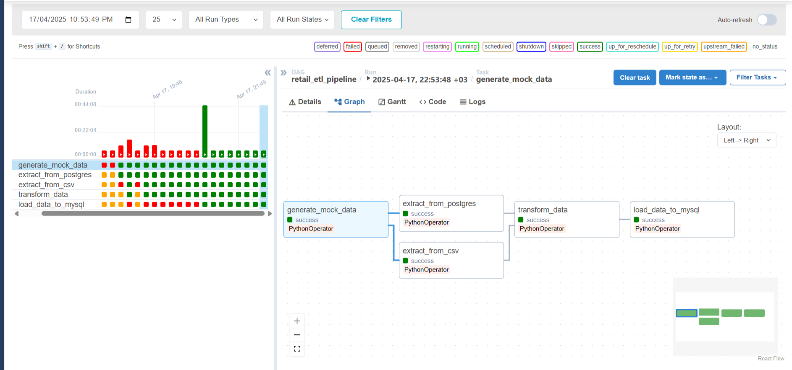

# Homework 2 

This project sets up a development environment using Docker Compose, including Apache Airflow, PostgreSQL, MySQL, a Python backend API, and a React frontend.

## Prerequisites

*   **Docker:** Ensure Docker Desktop (or Docker Engine + Docker Compose) is installed and running on your system

## Getting Started


1.  **Configure Environment Variables:**
    This project uses an `.env` file to manage configuration like host port mappings and database credentials. A template is provided.

    *   **Important:** Check the `POSTGRES_HOST_PORT` (default: `5433`) and `MYSQL_HOST_PORT` (default: `3307`) values in the `.env` file. if you're already using those ports in your computer then change them (e.g., `5434`, `3308`).

3.  **Build and Run the Application:**
    Use Docker Compose to build the images and start all the services.
    ```bash
    docker-compose up --build -d
    ```
   

4.  **Wait for Services to Initialize:**
    It might take a bit for all services, especially Airflow and the databases, to initialize completely. Airflow needs to run its database migrations (`airflow db init`) on the first run.

## Accessing Services

when the container runs successfully you can check and test the services:

*   **Airflow Web UI:**
    *   URL: [http://localhost:8080](http://localhost:8080)
    *   Login: `admin` / `admin` as you can see in the docker compose file. 

*   **Frontend Application:**
    *   URL: [http://localhost:3000](http://localhost:3000)

*   **Backend API:**
    *   The backend runs on port `5000` inside the Docker network and is exposed on port `5000` on the machine.
   
    *   The frontend application is already configured (via `REACT_APP_API_URL`) to communicate with the backend at this address.

*   **Database Access (Direct):**
    *   **PostgreSQL:** Connect using a GUI (pgAdmin) to `localhost` on the port specified by `POSTGRES_HOST_PORT` in your `.env` file. Use: `airflow`/`airflow`, database `airflow`.
    *   **MySQL:** Connect using a tool like `mysql` or MySQL Workbench to `localhost` on the port specified by `MYSQL_HOST_PORT` in your `.env` file. Use: `airflow`/`airflow`, database `airflow`.

## Basic Testing

You can perform simple checks to ensure the services are running correctly:

*   **Check Running Containers:**
    ```bash
    docker-compose ps
    ```
    This command should list all the services.

*   **Check Airflow Health:**
    ```bash
    curl http://localhost:8080/health
    ```
    You should receive a response indicating the health status.

*   **Check Frontend:**
    Open [http://localhost:3000](http://localhost:3000) in your web browser. It should load the React application.

## Stopping the Application

*   **Stop and Remove Containers:**
    ```bash
    docker-compose down
    ```
    This stops and removes the containers defined in the `docker-compose.yml` file.

*   **Stop, Remove Containers, and Remove Volumes:**
    If you want to remove the database data (Postgres and MySQL volumes) to start completely fresh:
    ```bash
    docker-compose down -v
    ```

## Results 

Below are screenshots showcasing the final results in the Airflow UI and the frontend application:

**Airflow UI - DAG Run:**




**Frontend Application:**


## Reflection

During this project, i had to solve some issues that i struggled a bit to solve, it was about the connection between the airflow and PostgreSQL and MySQL databases in docker, but at the end i managed to resolve all the issue and everything worked well. 


